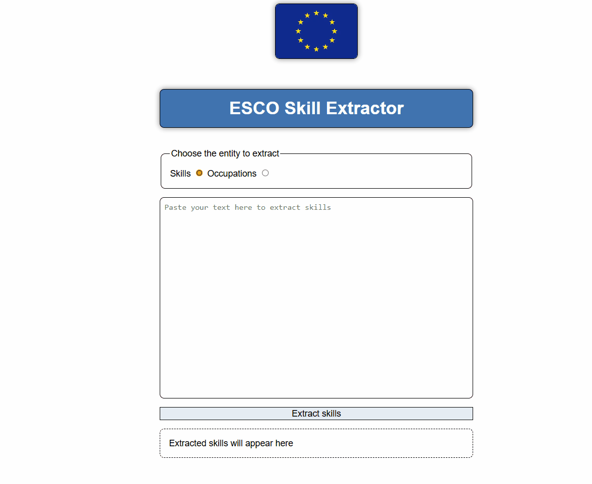

# ESCO Skill Extractor

This is a a tool that extract **ESCO skills** and **ISCO occupations** from texts such as job descriptions or CVs. It uses a transformer and compares its embedding using cosine similarity.

## Installation

```bash
pip install esco-skill-extractor
```

## Usage

### Via python

```python
from esco_skill_extractor import SkillExtractor

# Don't be scared, the 1st time will take longer to download the model and create the embeddings.
skill_extractor = SkillExtractor()

ads = [
    "We are looking for a software engineer with experience in Java and Python.",
    "We are looking for a devops engineer. Containerization tools such as Docker is a must. AWS is a plus."
    # ...
]

print(skill_extractor.get_skills(ads))
# [
#     [
#         "http://data.europa.eu/esco/skill/19a8293b-8e95-4de3-983f-77484079c389",
#         "http://data.europa.eu/esco/skill/ccd0a1d9-afda-43d9-b901-96344886e14d",
#     ],
#     [
#         "http://data.europa.eu/esco/skill/11430d93-c835-48ed-8e70-285fa69c9ae6",
#         "http://data.europa.eu/esco/skill/ae4f0cc6-e0b9-47f5-bdca-2fc2e6316dce",
#         "http://data.europa.eu/esco/skill/ce8ae6ca-61d8-4174-b457-641de96cbff4",
#         "http://data.europa.eu/esco/skill/f0de4973-0a70-4644-8fd4-3a97080476f4",
#     ],
# ]
print(skill_extractor.get_occupations(ads))
# [
#     [
#         "http://data.europa.eu/esco/occupation/10469d70-78a3-4650-9e29-d04de13c62c1",
#         "http://data.europa.eu/esco/occupation/1c5a896a-e010-4217-a29a-c44db26e25da",
#         "http://data.europa.eu/esco/occupation/4874fa37-0cd1-4a68-aed8-a838851f242d",
#         "http://data.europa.eu/esco/occupation/579254cf-6d69-4889-9000-9c79dc568644",
#         "http://data.europa.eu/esco/occupation/57af9090-55b4-4911-b2d0-86db01c00b02",
#         "http://data.europa.eu/esco/occupation/f2b15a0e-e65a-438a-affb-29b9d50b77d1",
#         "http://data.europa.eu/esco/isco/C2512",
#         "http://data.europa.eu/esco/isco/C2514",
#     ],
#     [
#         "http://data.europa.eu/esco/occupation/2fb96c6c-8d0b-4ef0-b1ee-3e493305e4eb",
#         "http://data.europa.eu/esco/occupation/349ee6f6-c295-4c38-9b98-48765b55280e",
#         "http://data.europa.eu/esco/occupation/781a6350-e686-45b9-b075-e4c8d5a05ff7",
#         "http://data.europa.eu/esco/occupation/93b11f0f-69af-4ece-b9da-f29aab7d38d3",
#         "http://data.europa.eu/esco/occupation/bb609566-3ab6-44dd-8f48-cf0b15b96827",
#         "http://data.europa.eu/esco/occupation/cc867bee-ab5c-427f-9244-f7a204d9574b",
#     ],
# ]
```

### Via GUI

```bash
# Visit the URL printed in the console.
# run python -m esco_skill_extractor --help for more options.
python -m esco_skill_extractor
```



### Via API

```bash
# Visit the URL printed in the console.
# run python -m esco_skill_extractor --help for more options.
python -m esco_skill_extractor
```

```js
async function getSkills() {
  const texts = [
    "We are looking for a software engineer with experience in Java and Python.",
    "We are looking for a devops engineer. Containerization tools such as Docker is a must. AWS is a plus.",
    // ...
  ];

  // Default host is localhost, and default port is 8000. Check CLI options for more.
  const response = await fetch("http://localhost:8000/extract-skills", {
    method: "POST",
    headers: {
      "Content-Type": "application/json",
    },
    body: JSON.stringify(texts),
  });

  const skills = await response.json();
  console.log(skills);
  //  [
  //    [
  //      "http://data.europa.eu/esco/skill/19a8293b-8e95-4de3-983f-77484079c389",
  //      "http://data.europa.eu/esco/skill/ccd0a1d9-afda-43d9-b901-96344886e14d",
  //    ],
  //    [
  //      "http://data.europa.eu/esco/skill/11430d93-c835-48ed-8e70-285fa69c9ae6",
  //      "http://data.europa.eu/esco/skill/ae4f0cc6-e0b9-47f5-bdca-2fc2e6316dce",
  //      "http://data.europa.eu/esco/skill/ce8ae6ca-61d8-4174-b457-641de96cbff4",
  //      "http://data.europa.eu/esco/skill/f0de4973-0a70-4644-8fd4-3a97080476f4",
  //    ],
  //  ]
  const occupations = await fetch("http://localhost:8000/extract-occupations", {
    method: "POST",
    headers: {
      "Content-Type": "application/json",
    },
    body: JSON.stringify(texts),
  });
}
```

## Possible keyword arguments for `SkillExtractor`

| Keyword Argument     | Description                                                                     | Default                        |
| -------------------- | ------------------------------------------------------------------------------- | ------------------------------ |
| skill_threshold      | Skills surpassing this cosine similarity threshold are considered a match.      | 0.45                           |
| occupation_threshold | Occupations surpassing this cosine similarity threshold are considered a match. | 0.55                           |
| device               | The device where the copulations will take place. AKA torch device.             | "cuda" if available else "cpu" |

## How it works

1. It creates embeddings for esco skills and ISCO occupations.
2. It creates embeddings for the sentences of the input texts.
3. It compares the embeddings of of the selected entity and the sentences using cosine similarity and it takes the maximum value.
4. An entity matches a sentence if the cosine similarity is above a certain threshold.
